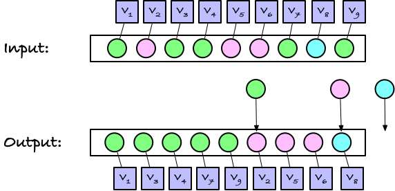

# Experimenting with bucket sort

This repo contains a bit of code for learning about count and bucket sort. It isn't a proper lesson, so adjust your expectations, but if you look at the `python` directory then there really is an exercise (and my own solution to it, if you feel lazy today).

If you have had CTiB or GSA, you will already have seen these techniques for sorting, although the CTiB version was a simple but inefficient Python version. Here, we can explore how the techniques really work [1].

## Count and bucket sort

Both algorithms aim at sorting some set of values according to a key that is a small non-negative integer. You *can* use them to sort more complex objects, and they should be in your programming arsenal for that, but we can talk about that another day if you are interested. Here, we'll just assume that we have one of two situations. Either you have some sequence of `n` small integers `[ k1, k2, k3, ..., kn ]` or you have key-value pairs `[ (k1,v1), (k2,v2), (k3, v3), ..., (kn,vn) ]` where we for all keys `k` we have `0 <= k < K` for some `K`.

In the first case we want to produce a sequence `[ k1', k2', ..., kn' ]` that is the keys `[ k1, k2, k3, ..., kn ]` in sorted order. (And you know what sorted means).

In the second case, you want to produce a permutation of the key-value pairs `[ (k1,v1), (k2,v2), (k3, v3), ..., (kn,vn) ]` `[ (k1',v1'), (k2',v2'), ..., (kn',vn') ]` where they keys are in sorted order.

The first case is particularly easy, exactly because the keys are small non-negative integers. That means that we can efficiently (in time `O(n+K)` and space `O(K)`) build a table that maps each `k`, `0 <= k < K`, to the number of occurrences of `k` in the input. For example, if our input were `[1, 2, 1, 1, 2, 2, 1, 4, 1]` we would map

```
0 -> 0
1 -> 5
2 -> 3
3 -> 0
4 -> 1
```

with `K == 5`. Since we are indexing with small integers, a natural representation of such a map, with minimal overhead, is an array `[0, 5, 3, 0, 1]`.

If we have a count of our input keys we already know what the output should be. If there are zero 0s we start with putting zero 0s in the output. Then, if there are 5 1s we put five ones in the output. We then have 3 2s, so we put three twos, and so on.


We don't need to know anything about the input except for how many times we have each key to correctly construct the output. Since we only use counts, this algorithm is called *count sort*.

The second case is slightly more complicated. It is not enough just to output the right number of keys, we need to output the right values as well, and in the right order, and values can be arbitrarily more complicated than the keys. Still, the output will come in blocks (called "buckets") of the same key. It is from the "buckets" that you get the name *bucket sort*.

If you have the same keys as above, just with associated values, you would still get a block of five key-value pairs where the keys are 1, then a block of three key-value pairs where the key is 2, and then finally a single pair with the key 4.


When you have to sort this way, you start with counting the number of occurrences of each key, just as before, and then you use the counts to define the buckets. If `counts` is your array of counts (for example `counts = [0, 5, 3, 0, 1]`) then define `buckets[k] = sum(counts[:k])`, i.e., the sum of counts up to, but not including, key `k`.

```
counts  = [0, 5, 3, 0, 1]
buckets = [0, 0, 5, 8, 8]
```

If you actually compute this as `buckets[k] = sum(counts[:k])` it takes `O(k)` to compute `buckets[k]`, with a total time of `O(K²)`, but you can of course handle it with dynamic programming: `buckets[k] = buckets[k - 1] + counts[k - 1]` and get it done in `O(K)`.

This array tells you where the bucket for each key starts, at index `buckets[k]`.


Now, when you need to copy the key-value pairs, you run through the indices `i` of the input, one by one. It doesn't have to be left-to-right, but let's assume that it is. That means we start at index `0` and let's say the key there is `x[0].key`. Since `buckets[k]` tells us where the `k` bucket starts, `buckets[x[0].key]` tells us where the first key-value pair should go.


We can copy the pair to that index, and then increment `buckets[x[0].key]`

```python
   buckets[x[0].key] += 1
```

so it now points to the next available slot.


Then we go to the next pair in `x`, `x[1]`. Find the bucket for the key there, copy the pair, and increment the bucket pointer.

```python
   out[buckets[x[1].key]] = x[1]
   buckets[x[1].key] += 1
```


Then you do the same thing again and again and again...

```python
   out[buckets[x[i].key]] = x[i]
   buckets[x[i].key] += 1
```


...and you continue until you are done. At this point, `bucket[k]` will point one-past the last element in the bucket for the `k` keys, but that is usually not so important--it just happens to be where they are pointing.



* It takes time `O(len(x) + K)` to count the keys: you can initialise the `counts` array to zeros in time `O(K)` and then scan through `x` to count the keys in time `O(len(x))` since you can access and increment `counts[k]` in `O(1)`. The space complexity is `O(K)` for representing `counts`.
* You can then compute `buckets` as a cummulative sum in time `O(K)`. If you reuse `counts` for `buckets` the space complexity for this is `O(1)`--you have already paid `O(K)` for `counts` and you are not paying anything more--and if you put `buckets` in a new array it is `O(K)`.
* Moving the key-values pairs from `x` to `out` takes `O(len(x))` since you process each pair only once and you can copy a pair and increment `buckets[k]` in `O(1)`. You need `O(len(x))` extra space for `out` but that is the only extra space you need, so the space complexity is `O(len(x))`.

Adding everything up, a bucket sort takes `O(K+len(x))` time and uses `O(K+len(x))` space. 

In typical cases where we would use bucket sort, `K` is bounded by a constant, say the size of an alphabet (e.g. `K == 4` for DNA strings) or our keys are bytes (8-bit integers) so `K == 256`. That means `O(K) == O(1)` and then the complexity is `O(len(x))` in both time and space.

In contrast, using a comparative sort algorithm will never be faster than `O(len(x)*log(len(x)))`.

**Exercise:** Implement a bucket sort. In the sub-directories of this repo you can find implementations, and you are welcome to look at those, but you might find it interesting to try implementing it yourself before you look at how I have done it.

**Exercise:** Convince yourself that you understand when we should use this method and when we should not. What happens when `K` is not a constant but some function of `K`? When is bucket sort still appealing compared to other algorithms? Or what about when `K` is a constant, but a very large one? In that case the amortised complexity is still `O(len(x))`, but the `O(K) == O(1)` time and space complexity might still make the approach unworkable in practice.

**Exercise:** What happens if `K` is a constant, but really large? Say, what if the keys are 32-bit integers so `K == 2**32`?

**Exercise:** If the keys are both negative and positive, say they fall in the range `(-K,K)`, how would you sort them? If they are in two's-complement, what would happen if you just pretended that they were positive?


## Stable and unstable versus in-place sorting

When we have key-value pairs, the same key might appear with more than one value, `(ki,vi)` and `(kj,vj)` with `ki == kj`. Sorting the pairs tells us that if `ki < kj` then `(ki,vi)` must come before `(kj,vj)` but if `ki == kj` we haven't put any restrictions on the order of pairs with the same key. Sometimes, however, that is useful, and we say that a sorting algorithm is *stable* if when `ki == kj` and index `i` < `j`, then `(ki,vi)` comes before `(kj,vj)`. That is, the sort is stable if pairs with the same keys come in the same order in the output as they have in the input.

The bucket sort we saw above is stable. We process the key-value pairs in the order they appear in the input when we process them left-to-right and we always append pairs to their bucket.

Getting a stable version of a sorting algorithm sometimes incurs extra overhead. The quick-sort algorithm, for example, runs in `O(n log n)` with very little overhead, because its partitioning procedure swaps elements very efficiently, but if you want it to be stable, the partitioning gets more complicated, and that hurts the running time, so if you need a stable comparison sort you are often better off with a slower variant of merge sort, such as the Tim sort algorithm that is used in Python and many other languages' runtime system.

Our bucket sort is both stable and highly efficient in running time, but it isn't "in place", meaning that it uses more than `O(1)` memory.[2] We use `O(K)` memory for the buckets and `O(len(x))` to create a new `out` array. The `O(K)` is rarely a problem, we expect `K` to be small anyway, but the `O(len(x))` can be. If we were trying to sort an array of 32-bit integers of the length of the human chromosome 1, about 250 million nucleotides, then `x` and `out` are both a gigabyte. We can't do anything about `x`, we need the input data after all, but it would be nice not to have to use memory on `out` as well.

I don't know how to bucket sort both stable and in-place (I plan to find out some day, I just haven't asked the right people yet), but I've come up with a couple of simple unstable in-place versions.

They are both just a handful of lines of code, and they are roughly the same level of programming complexity, but the second saves one `K`-length array compared to the first. They are both based on swapping elements into their right buckets, which is what makes them unstable (similar to how selection sort is unstable).

The first one works like this. We start by building the `buckets` as before, but this time we make two copies of it,`begin` and `end`. We will use the two arrays to keep track of where (current) buckets start and end. Elements that have been correctly placed in their bucket will have a key `k` between `begin` and `end` (with the first included and the second excluded, like all slices in Python).

A check for this could look like this in Python

```python
def in_bucket(i: int, k: int, begin: list[int], end: list[int]) -> bool:
    """Is i sitting in the bucket for key k?"""
    begin[k] <= i < end[k]
```

Since we haven't placed any values to begin with, the initial state has `begin[k] == end[k]` for all keys, but the `begin` and `end` pointers both point at the beginning of the buckets.


Now the idea is this. If we are looking at `x[i]` it will either be in its right bucket `in_bucket(x[i].key, begin, end)`, in which case we should just move on to the next element (`i += 1`), or it is not in the right bucket, in which case we will move it there. We do that by swapping `x[i]` with whatever element sits at the end of `x[i]`'s bucket, `end[x[i].key]` and then we increment the `end` pointer for that key. When we do this, we are in effect appending `x[i]` to its right bucket, expanding the bucket in the process.

If we use the example we have looked at so far, the first element we look at (at `x[0]`) has a "green" key, and while it sits in what will be the green bucket at the end, we don't know that yet from the `begin` and `end` arrays. The green `begin` and `end` both point at zero, so `begin[x[0].key] <= 0` is true but `0 < end[x[0].key]` is false.

We swap `x[0]` with where it is supposed to go, which happens to be where it already is, but that happens from time to time. Then we increment the green `end`. Thus the appending to the green bucket is completed.

After that, `x[0]` sits in the bucket (now that `ends[x[0].key] == 1`) and we can move on to the next index.


To handle the rest of the array, we just repeat these two operations until `i` reaches the end of `x`.


**Exercise:** Try implementing this algorithm. Then try implementing it in another programming language.


----

[1] The kind of bucket sort we consider here is really called a *histogram sort*. The more general bucket sort isn't guaranteed to run in linear time, as it splits keys into buckets and then needs to sort the buckets using some other method. We ignore the second part, since in bioinformatics we most frequently sort things where the second step isn't needed. Still, now you know that if you hear people talk about bucket sort as something else than what you see here, they might not be wrong. We are just looking at a specific kind of bucket sort.

[2] Sometimes people will allow `O(log n)` memory for an algorithm and still call it in-place. That allows you, for example, to use divide-and-conquer recursion where the recursion depth can be `O(log n)`. Here, I allow myself to call a bucket sort in-place if it uses `O(K)` extra memory but not more.
